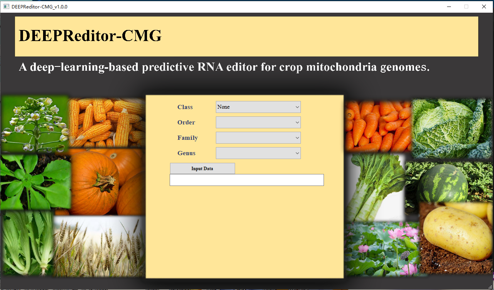
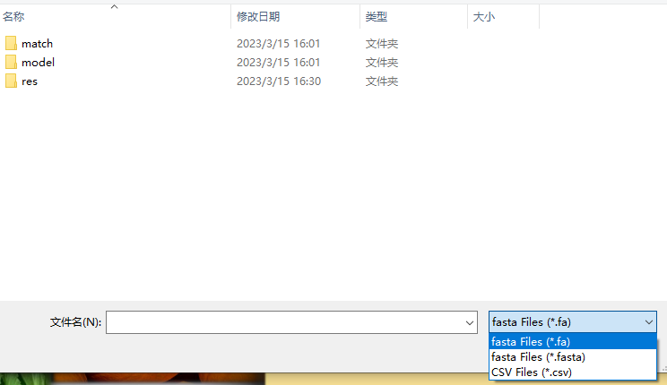
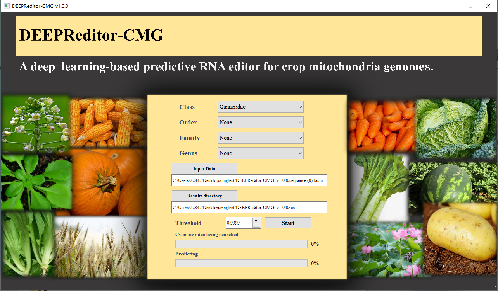
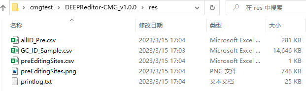
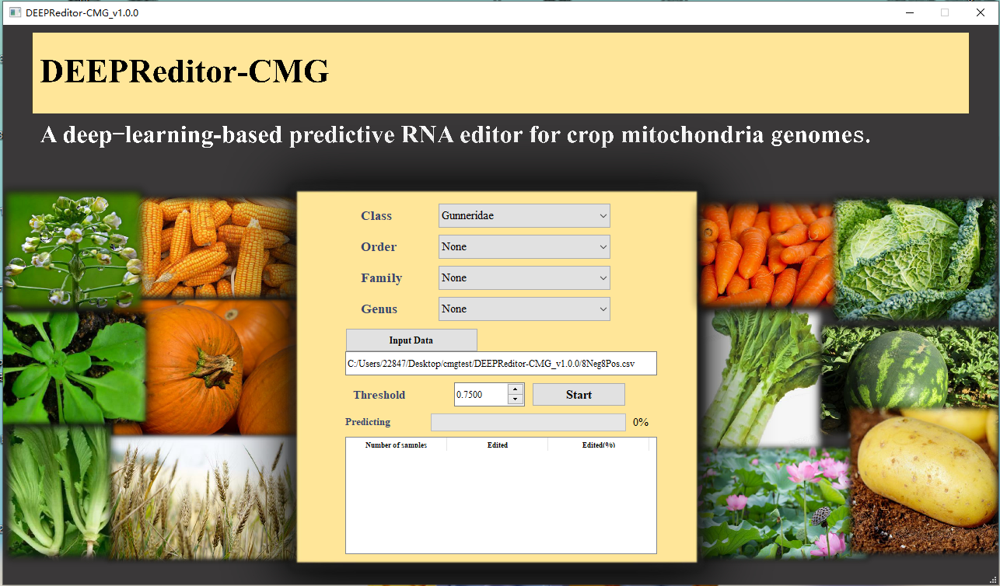

## About
### [DEEPReditor-CMG_v1.0.0](https://github.com/Qinsidong/DEEPReditor-CMG/releases/tag/DEEPReditor-CMG_v1.0.0) (Click to download)<br>
This project is based on the `DEEPReditor-CMG` model to build a `visual interface` for user-friendly operation.\
The project is developed on `windows` and runs in `python3` environment, where the main `third-party libraries` used are:
```
numpy
matplotlib
tensorflow
pandas
PyQt5
```
## Project structure
This project requires dependencies to run, which contain relative paths, so please make sure you `keep the relative paths` in the project folder. \
The directory structure is as follows:
```
│─DEEPReditor-CMG_v1.0.0
    │  background.jpg
    │  DEEPReditor-CMG_v1.0.0.exe-----Executable file entry
    │  
    ├─match
    │      append.csv
    │      MatchModel.xlsx
    │      MatchSpecies.xlsx
    │      
    ├─model-----Storage folder for pre-trained models
    │      Model0.h5
    │      Model1.h5
    │      Model10.h5
    │      Model11.h5
    │      Model12.h5
    │      Model13.h5
    │      Model14.h5
    │      Model15.h5
    │      Model16.h5
    │      Model17.h5
    │      Model18.h5
    │      Model2.h5
    │      Model3.h5
    │      Model4.h5
    │      Model5.h5
    │      Model6.h5
    │      Model7.h5
    │      Model8.h5
    │      Model9.h5
    │      
    └─res
```
## Run the project program
This project can run on any system with python environment, we recommend using `python 3.8.x` version.We use the pyinstaller library to package the project program, users can directly double click `DEEPReditor-CMG_v1.0.0.exe` in the `DEEPReditor-CMG_v1.0.0` directory to run it.
## How to use
The project supports the operation of `fasta format files (including fa format) `and `csv format files` respectively, and the following describes the use of each of the two file formats.
### Prediction of genome-wide (the file object is in fasta format)



After entering the software, the user needs to select `Class, Order, Family and Genus` in order, the user can have some defaults, but at least need to `select Class`, and then click the Input Data button to select the file data to be used.



In the bottom right corner of the open file selection page you can select the desired file format, `select fa or fasta format` to select the corresponding file.



After that, click the `Results directory` button to select the folder where the results are stored, all the generated results files will be stored in this folder, finally enter the` Threshold value (default is 0.9999)` and click the `Start` button to start running. After running, you can enter the selected results folder to view all the results data.



### Prediction of user-specific data (the file object is in csv format)


After entering the software, the user needs to select `Class, Order, Family and Genus` in order, the user can have some defaults, but at least need to `select Class`, and then click the Input Data button to select the file data to be used.


In the bottom right corner of the open file selection page you can select the desired file format, `select csv format` to select the corresponding file.



Finally, enter `Threshold value (default is 0.7500)` and click the `Start` button to start running.
